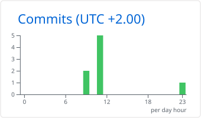

### 👋 Hey, I'm sagefromtheeast.

🎓 I have a Bachelor of Technology in Computer Science, and 🚧 I'm still becoming a developer.

🤖 Most of what's on this profile was built *with* AI: I plan the product, make the calls, and work through the code alongside tools like **Claude Code** and **Antigravity**. 📈 Every project teaches me a little more about writing it myself, and that's the direction I'm heading.

🇿🇼 Based in Zimbabwe · ⚽ football and data · 🔒 privacy-first tools · 🧠 learning in public

---

#### 💫 About me

- 🎓 **Background:** BTech in Computer Science
- 🤖 **How I build:** AI-assisted with Claude Code and Antigravity, learning the fundamentals as I go
- ⚽ **Into:** coding, data science, football and football analytics
- 🔒 **Care about:** tools that help everyday people keep their data private

---

#### 🛠️ What I build with

  

Plus shadcn/ui, React Query, Zustand, Dexie, Recharts and jsPDF when a project calls for them.

---

#### 📦 Featured projects

**🎓 Key university project**
- **[SAG3-PARK](https://github.com/sagefromtheeast/SAG3-PARK)**: a parking management system. It reads number plates from photos with YOLO and EasyOCR, identifies the car with Gemini, allocates a spot, and bills by time on exit. `Python` `Streamlit` `OpenCV` `SQLite`

**🖍️ Building now**
- **[Nestmark](https://github.com/sagefromtheeast/sage-highlights-unleashed)**: a browser extension for highlighting the web and keeping it. Highlights come back when you revisit a page, export to Markdown, CSV or JSON, and never leave your device. No account, no analytics. `Manifest V3` `JavaScript` `Playwright`

**⚽ Football**
- **[Red Buzz](https://github.com/sagefromtheeast/football-tg-bot)**: a Telegram bot that filters Man Utd news from trusted accounts on X and posts it to a channel, running for $0 on Cloudflare Workers. `TypeScript` `Cloudflare D1`
- **[Toby-Tactics](https://github.com/sagefromtheeast/Toby-Tactics)**: a football tactics board. `React Spring` `Dexie` `React Router`

**🤖 Bots and experiments**
- **[Podcast Telegram Notifier](https://github.com/sagefromtheeast/podcast-telegram-notifier)**: watches podcast RSS feeds and sends each new episode to Telegram with artwork, show notes and listen buttons. Runs free on GitHub Actions. `Node.js` `GitHub Actions`
- **[Watermark-Remover](https://github.com/sagefromtheeast/Watermark-Remover)**: an experiment in removing Gemini's SynthID watermark from images.

**🧰 Everyday tools**
- **[Penny-Wise](https://github.com/sagefromtheeast/Penny-Wise)**: a budgeting app for keeping track of where the money goes.
- **[Glen-Norah-Youth-Management-System](https://github.com/sagefromtheeast/Glen-Norah-Youth-Management-System)**: a dashboard for running a youth group, with PDF export. `React` `Firebase` `Tailwind` `jsPDF`

**🎵 Community and faith**
- **[Shona-Song-Book](https://github.com/sagefromtheeast/Shona-Song-Book)**: a Shona songbook, and my first full-stack app. It has its own [privacy policy](https://github.com/sagefromtheeast/Songbook-Privacy-Policy).
- **[Soul-Feed-Store](https://github.com/sagefromtheeast/Soul-Feed-Store)**: an online store for Christian fashion. `React` `Vite` `Express`

---

#### 📊 Stats and highlights

<picture>
  <source media="(prefers-color-scheme: dark)" srcset="https://streak-stats.demolab.com?user=sagefromtheeast&theme=github-dark-blue&hide_border=true">
  
</picture>

🔥 Total contributions · current streak · longest streak

📅 Daily contributions over the last year

<picture>
  <source media="(prefers-color-scheme: dark)" srcset="./profile-summary-card-output/github_dark/0-profile-details.svg">
  
</picture>

<picture>
  <source media="(prefers-color-scheme: dark)" srcset="./profile-summary-card-output/github_dark/3-stats.svg">
  
</picture>
<picture>
  <source media="(prefers-color-scheme: dark)" srcset="./profile-summary-card-output/github_dark/4-productive-time.svg">
  
</picture>

---

#### 🌱 Right now

- 📖 Getting better at reading and writing code without the AI doing the heavy lifting
- 📈 Learning data science, with football data as my playground
- 🛡️ Looking for privacy problems worth building small tools for

📬 If any of that overlaps with what you're doing, open an issue on one of my repos and say hi.

---

#### ✍️ Random dev quote

<picture>
  <source media="(prefers-color-scheme: dark)" srcset="https://quotes-github-readme.vercel.app/api?type=horizontal&theme=dark">
  
</picture>
